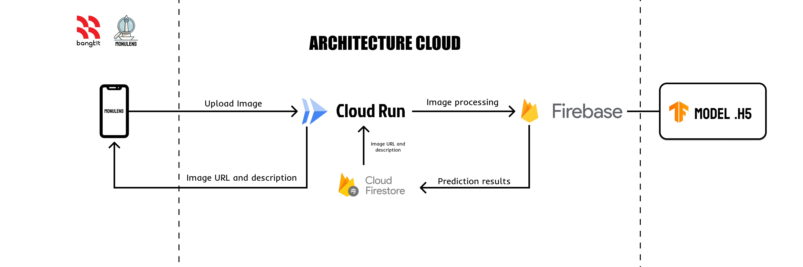
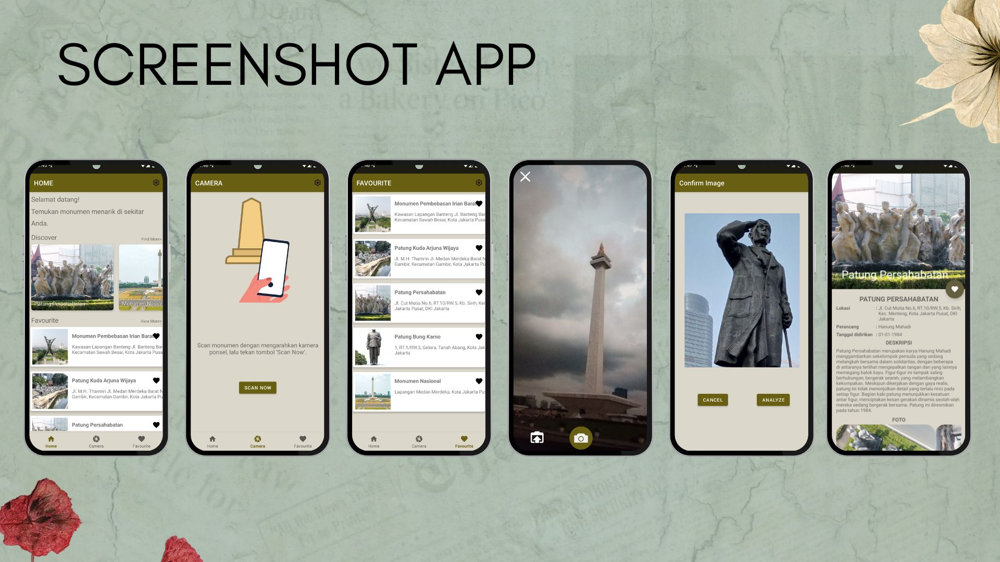

# MonuLens — Monument Recognition Mobile App

MonuLens is an intelligent mobile application that allows tourists to scan historical monuments and instantly access information about their history, significance, and cultural background using image recognition technology.

This project was developed as part of the **Bangkit Academy Capstone Project**.

---

# Project Overview

MonuLens helps travelers discover historical information about monuments in real time.

By simply scanning a monument using the mobile camera, the system identifies the monument and returns relevant historical information through a cloud-based backend service.

---

# Background

Many travelers visit historical monuments but only observe them from a distance without fully understanding their historical or cultural significance.

Due to time limitations and lack of accessible information on-site, tourists often miss valuable context about the monuments they encounter.

---

# Solution

MonuLens solves this problem by combining **mobile development, machine learning, and cloud computing** to create a smart monument recognition application.

Users can scan a monument using their smartphone camera and instantly receive information about:

* Monument history
* Cultural significance
* Background information

---

# System Architecture

The system consists of three main components:

Mobile Application
Machine Learning Model
Cloud Backend Infrastructure

The backend is deployed on **Google Cloud Run**, which provides scalable API services that connect the mobile application with the machine learning model.

---

# Application Preview

Below are screenshots of the MonuLens mobile application.

---

# Demo Video

Watch the application demo here:

)

---

# My Role — Cloud Computing

In this project I worked as part of the **Cloud Computing team**, responsible for building and deploying the backend infrastructure.

Responsibilities:

* Developed a **RESTful API using Python and Flask**
* Integrated the **TensorFlow machine learning model**
* Built API endpoints to process monument image requests
* Managed communication between mobile app and ML model
* Deployed backend services using **Google Cloud Run**
* Ensured scalable and reliable backend performance

---

# Technology Stack

Backend Development

* Python
* Flask

Machine Learning Integration

* TensorFlow

Cloud Infrastructure

* Google Cloud Platform
* Google Cloud Run

Architecture

* RESTful API

---

# Project Repository

The full project source code is available in the official team repository:

https://github.com/MonuLen

---

# Project Type

Bangkit Academy Capstone Project
Cloud Computing Learning Path
